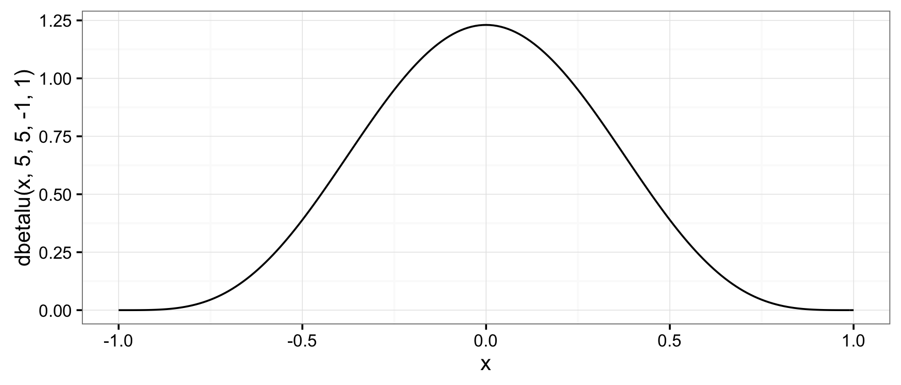
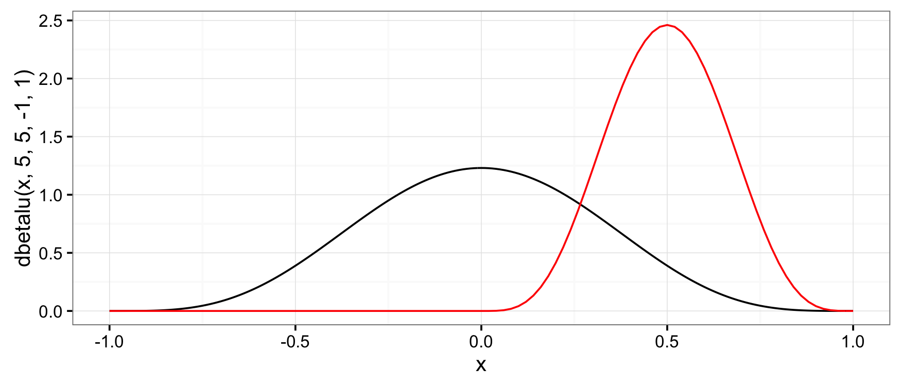
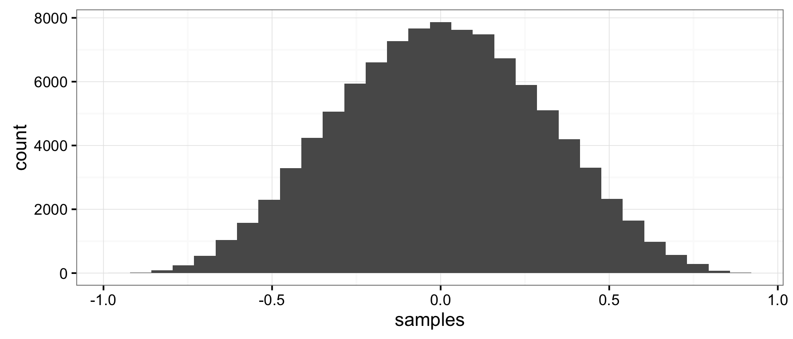

<!-- README.md is generated from README.Rmd. Please edit that file -->
**betalu**
==========

**betalu** implements the `(d/p/q/r)` statistics functions for the [general support beta distribution](https://en.wikipedia.org/wiki/Beta_distribution) (also called the four parameter beta) in [R](http://cran.r-project.org). It is ideal for using in other packages since it is light weight and leverages the `(d/p/q/r)beta()` line of functions maintained by CRAN.

### Getting **betalu**

<!-- There are two ways to get __betalu__.  For the [CRAN version](https://cran.r-project.org/package=betalu), use -->
<!-- ```{r, eval=FALSE} -->
<!-- install.packages("betalu") -->
<!-- ``` -->
<!-- For the development version, use -->
Right now, you have to get **betalu** from GitHub, since it's not on CRAN yet. Here's how you do that:

``` r
# install.packages("devtools")
devtools::install_github("dkahle/betalu")
```

### The `(d/p/q/r)betalu()` functions

The defining property of the betalu distribution is that it is the beta distribution drawn to a different support. In other words, it is the distribution of the random variable \(Y = (u-l)*X + l\), where \(X\) has a beta distribution.

The [PDF](https://en.wikipedia.org/wiki/Probability_density_function) (the *f(x)*) can be evaluated with the `dbetalu()` function:

``` r
library(betalu)
library(ggplot2); theme_set(theme_bw())
x <- seq(-1, 1, .01)
qplot(x, dbetalu(x, 5, 5, -1, 1), geom = "line")
```

 The distribution is the shifted and scaled version of the standard beta distribution with support \[0,1\], shown in red below:

``` r
qplot(x, dbetalu(x, 5, 5, -1, 1), geom = "line") +
  stat_function(fun = dbeta, args = list(shape1 = 5, shape2 = 5), color = "red")
```



The [CDF](https://en.wikipedia.org/wiki/Cumulative_distribution_function) can be evaluated with the `pbetalu()` function:

``` r
f <- function(x) dbetalu(x, 5, 5, -1, 1)
q <- -0.5
integrate(f, -1, q)
#  0.04892731 with absolute error < 5.4e-16
(p <- pbetalu(q, 5, 5, -1, 1))
#  [1] 0.04892731
```

The [quantile function](https://en.wikipedia.org/wiki/Quantile_function) can be evaluated with `qbetalu()`:

``` r
qbetalu(p, 5, 5, -1, 1) # = q
#  [1] -0.5
```

And random number generation can be performed with `rbetalu()`:

``` r
set.seed(1)
rbetalu(5, 5, 5, -1, 1)
#  [1] -0.22368019  0.06553507 -0.29829009  0.56115084  0.11761102
```

``` r
qplot(rbetalu(1e5, 5, 5, -1, 1), bins = 30)
```

 `rbetalu()` can be used to obtain a [Monte Carlo](https://en.wikipedia.org/wiki/Monte_Carlo_method) estimate of the probability given by `pbetalu()` above:

``` r
samples <- rbetalu(1e5, 5, 5, -1, 1)
mean(samples <= q)
#  [1] 0.04945
```

Moreover, we can check the consistency and correctness of the implementation with

``` r
qplot(samples, geom = "density") + 
  stat_function(fun = f,  color = "red")
```


